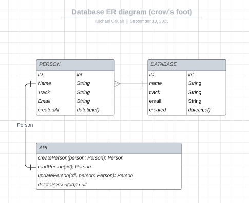

# API Documentation

## Introduction

### This document provides the API documentation for the Person API. The Person API is a RESTful API that provides endpoints for creating, reading, updating, and deleting people.

## Endpoints

### The Person API has the following endpoints:

### Create a New Person

## Endpoint: /api

## HTTP Method: POST

## Request Format:

```json
{
  "name": "Oduah Michael",
  "track": "backend",
  "email": "oduahmichaelebuka@gmail.com"
}
```

## Response Format:

```json
{
  "id": 1,
  "message": "Person created successfully."
}
```

# Fetch Details of a Person

## Endpoint: /api/user_id

## HTTP Method: GET

## Response Format:

```json
{
  "id": 1,
  "name": "Oduah Michael",
  "email": "oduahmichaelebuka@gmail.com"
}
```

# Update Details of an Existing Person

## Endpoint: /api/user_id

## HTTP Method: PATCH

## Request Format:

```json 
{
  "name": "Updated Name",
  "track": "backend",
  "email": "updated@example.com"
}
```

## Response Format

```json
{
  "message": "Person updated successfully."
}
```

# Remove a Person

## Endpoint: /api/user_id

## HTTP Method: DELETE

## Response Format:

```json
{
  "message": "Person removed successfully."
}
```

# Sample Usage

## Create a New Person

## Request:

```json
POST /api HTTP/1.1
Host: your-api-url.com
Content-Type: application/json

{
  "name": "Jane Doe",
  "track": "backend",
  "email": "janedoe@example.com"
}

```

## Response:

```json
{
  "id": 2,
  "message": "Person created successfully."
}
```

## Fetch Details of a Person

## Request:

```json
GET /api/1 HTTP/1.1
Host: your-api-url.com
```

## Response

```json
{
  "id": 1,
  "name": "Oduah Michael",
  "track": "backend",
  "email": "oduahmichaelebuka@gmail.com"
}
```

## Update Details of an Existing Person

### Request:

```json
PATCH /api/1 HTTP/1.1
Host: your-api-url.com
Content-Type: application/json

{
  "name": "Updated Name",
  "age": 35,
  "email": "updated@example.com"
}

```

## Response:

```json
{
  "message": "Person updated successfully."
}
```

## Remove a Person
## Request:
```json
DELETE /api/1 HTTP/1.1
Host: your-api-url.com
```

## Response:
```json
{
  "message": "Person removed successfully."
}

```

# Known Limitations and Assumptions

- The API assumes that each person has a unique identifier (user_id) for read, update, and delete operations.

- Error handling and validation of inPATCH data are simplified in this example.

- No authentication or authorization mechanisms are implemented in this version.


# UML DIAGRAM
 

# Local Setup and Deployment

## To set up and deploy the API locally or on a server, follow these steps:

### Clone the repository from GitHub: git clone https://github.com/Dearie-cyber/Stage-2-HNG

### Navigate to the project directory: cd Stage-2-HNG

### Install dependencies:

## `npm install`

### Start the API server:

## `npm start`

### Access the API at https://hng-stage2-backend.vercel.app/ (adjust the port as needed).
